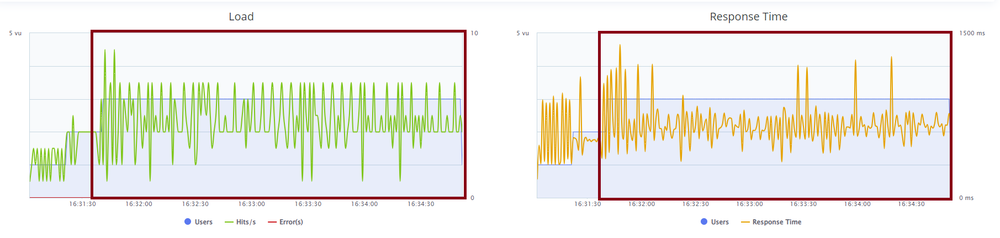

# TODO LIST

# 1. Follow README-DevEnv.md to setup dev environment for exercise
- [x] Able to run locally, debug, unit-test
- [x] Able to smoke-test and performance test

# Do the following tasks:
## Enhance product service
- [X] Delete product rpc call
- [X] Wire into smoketest.sh | -> ./test/nex-smoketest.sh local 
- [] (bonus) Wire into perf-test | -> ./test/nex-bzt.sh local
- [] (bonus) Wire unit-test for this method
## Enhance order service
- [X] List orders rpc call
- [X] Wire into smoketest.sh | -> ./test/nex-smoketest.sh local 
- [] (bonus) Wire into perf-test |-> 
- [] (bonus) Wire unit-test for this method
- [X] Execute performance test
- [] Question 1: Why is performance degrading as the test run longer?
    Currently it's using the same order of requests in nex-smoketest.sh, when we do not integrate with the DB list request, it will be shown a graphic like the following one:

    

    These graphis shows that the server appears to have certain instability, but it may be caused by my own computer enviroment, but the instability does not differ much over time after stablishing connection with the 3 users simmultaniously.

    But when we take a look at the test graphic when we have the orders list function, we have a decrease performance over-time:
    
- [] Question 2: How do you fix it?
- [] (bonus): Fix it

I wat this file to be shown... I may not be able to do everything, so... Nice to be read Arthur! I think....

Some of my anotations will be set as # (teixa)
Will try to list where they are:
- /gateway/gateway/service.py
