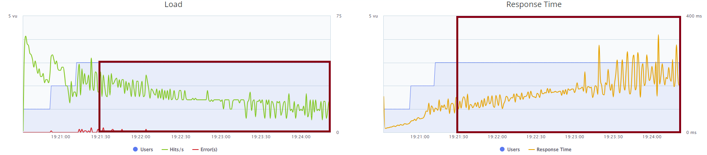
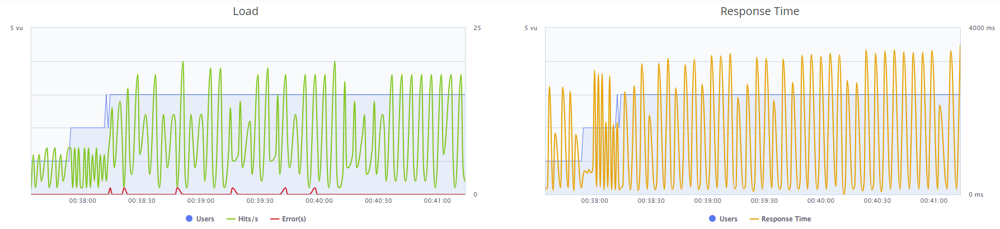

# TODO LIST

# 1. Follow README-DevEnv.md to setup dev environment for exercise

- [x] Able to run locally, debug, unit-test
- [x] Able to smoke-test and performance test

# Do the following tasks:
### Enhance product service

- [x] Delete product rpc call
- [X] Wire into smoketest.sh | -> ./test/nex-smoketest.sh local 
- [X] (bonus) Wire into perf-test | -> ./test/nex-bzt.sh local
- [X] (bonus) Wire unit-test for this method | -> ./dev_pytest.sh

## Enhance order service
- [X] List orders rpc call
- [X] Wire into smoketest.sh | -> ./test/nex-smoketest.sh local 
- [X] (bonus) Wire into perf-test |-> ./test/nex-bzt.sh local
- [X] (bonus) Wire unit-test for this method
- [X] Execute performance test
- [X] Question 1: Why is performance degrading as the test run longer?

After a while the system becomes stable as we see a stable graphic like the following one:

But when the test just starts, we have the response time increasing, consider only the red area, as before connecting 3 individuals, it's unfair to take a look:

This problem may be caused due to certain reasons:

    

        Poor Algorithm data Handling (NOTE IT'S EXPANDABLE MD AAAAAA)
    

    - Probably not the case, request response are pretty simple here
Poor Framework integration or use of wrong functions
    - Here got little confused about Redis integration, and if it would be better use of Postgres instead of adding another framework and a layer of complexity

    

        Non-optimal use of Messaging system (NOTE IT'S EXPANDABLE MD AAAAAA)
    

    - Here I'm kind curious, didn't find out RabbitMq parameters, if it's basic parameters, as far as I know it's a single queue, but for this case, we may use multiple queues poiting to certain consumers
    Example: If scaling was like 6 clients, would make 6 queues and 3 consumers in order to avoid system being ocious and being overloaded. 
Pod configuration in K8s
    - Due to scalability, Pods may be created to auto-scale, I'll not take a look here due do time, I'm not used to K8s, but am interested

Not fixing but Knowledge
this is the graph after setting listing in performance:

        

    

        Besides the following error, enviroment doesn't show
        Some of order creation execution fails with the error:
        (NOTE IT'S EXPANDABLE MD AAAAAA)
    

        error handling worker <WorkerContext [products.list] at 0x7f83151a0410>: b'id'
        Traceback (most recent call last):
        File "/home/wildclown/anaconda3/envs/nameko-devex/lib/python3.7/site-packages/nameko/containers.py", line 388, in _run_worker
            result = method(*worker_ctx.args, **worker_ctx.kwargs)
        File "/home/wildclown/codigos/nameko-devex/products/products/service.py", line 31, in list
            return schemas.Product(many=True).dump(products).data
        File "/home/wildclown/anaconda3/envs/nameko-devex/lib/python3.7/site-packages/marshmallow/schema.py", line 489, in dump
            obj = list(obj)
        File "/home/wildclown/codigos/nameko-devex/products/products/dependencies.py", line 58, in list
            yield self._from_hash(self.client.hgetall(key))
        File "/home/wildclown/codigos/nameko-devex/products/products/dependencies.py", line 32, in _from_hash
            'id': document[b'id'].decode('utf-8'),
        KeyError: b'id'
        error handling worker <WorkerContext [gateway.get_order] at 0x7f8314d021d0>: KeyError b'id'
        Traceback (most recent call last):
        File "/home/wildclown/anaconda3/envs/nameko-devex/lib/python3.7/site-packages/nameko/containers.py", line 388, in _run_worker
            result = method(*worker_ctx.args, **worker_ctx.kwargs)
        File "/home/wildclown/codigos/nameko-devex/gateway/gateway/service.py", line 96, in get_order
            order = self._get_order(order_id)
        File "/home/wildclown/codigos/nameko-devex/gateway/gateway/service.py", line 108, in _get_order
            return self.fill_order_products(order)
        File "/home/wildclown/codigos/nameko-devex/gateway/gateway/service.py", line 124, in fill_order_products
            product_map = {prod['id']: prod for prod in self.products_rpc.list()}
        File "/home/wildclown/anaconda3/envs/nameko-devex/lib/python3.7/site-packages/nameko/rpc.py", line 558, in __call__
            return rpc_call.result()
        File "/home/wildclown/anaconda3/envs/nameko-devex/lib/python3.7/site-packages/nameko/rpc.py", line 655, in result
            raise deserialize(error)
        nameko.exceptions.RemoteError: KeyError b'id'

        but to be honest, didn't tried much of Performance test before, so not really sure if my function fill_order_products broke this a little bit...
        I guess this may be caused by async, as the deleted element is the one get before, if thread get's resource while one is processing fill_order_products, it will delete and fail the previous GET

- [X] Question 2: How do you fix it?
    For this I've tried to discuss in topics in above question
    Was it correct? Tell me, please, would love to get some knowledge, and discuss my solutions ^~^
- [-] (bonus): Fix it

I want this file to be shown... I may not be able to do everything, so... Nice to be read Arthur! I think....
Also, I'm not used to python, sorry dear recruiter, I know that things would be better ;-;
